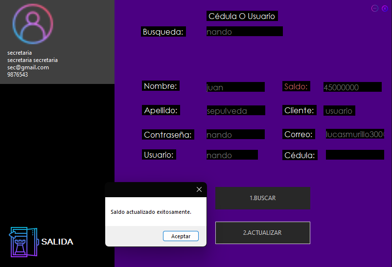

## CheckPoint #2

En esta segunda presentación de Proyecto de Aula lo que se busca es mejorar y "resolver" algunas funciones en las que se presentaban dificultades; ayuda también a mejoras en las presentaciones que se haran en el Futuro.

Si bien no se han inplementado algunas de las estructuras de datos que se solicitan en esta implementación, esperamos poder realizarlo en la siguiente presentación, la implementacion de las estructuras de datos elegidas en su totalidad.

### Implementación de una nueva función

En este caso se implementa un nueva ventana para un cargo creado de "Secretaria"; A este usuario se le asignan unos permisos, lo que permite poder actualizar información de los usuarios que están disponibles y a su vez poder actualizar saldos.

La "Secretaria" puede realizar la Búsqueda de los usuarios y actualizar la información que se desee.

## Un ejemplo:

En la primera imagen se muestra como se realiza la búsqueda del usuario "nando" registrado en la base de datos.

En la segunda imagen lo que se puede ver es la información que se registra en la base de datos a la hora de realizar la Búsqueda.

#### Prueba 

Ahora se procede a realizar la actualización del saldo.

Esto es con el fin de que el usuario "Secretaria" tenga la posibilidad de ingresar saldos, actualizar información mediante un caso de Atención al usuario que se halla presentado o cualquier otro caso externo que deba ser atendido por personal especifico. 

Por último se muestra el saldo actualizado en la Base de Datos.

PD: He de recalcar de nuevo que no solo se puede actualizar información de saldos, si no cualquier otra información pertitente a la que la "Secretaria" tenga acceso.

