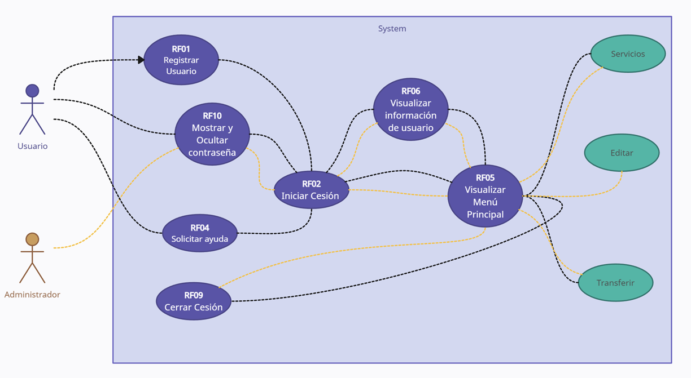
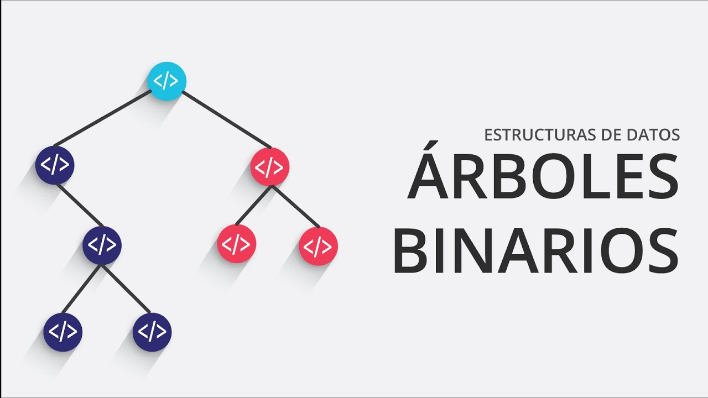
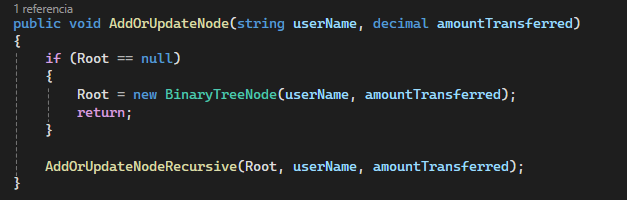
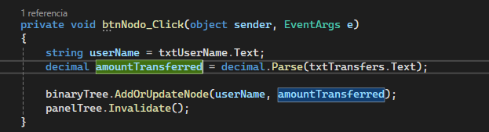

## Introducción

El proyecto **QuackPay** propone la creación de un sistema de gestión financiera basado en una moneda virtual que será utilizada exclusivamente dentro del entorno universitario. Los usuarios, en este caso, estudiantes, profesores y personal administrativo, podrán adquirir esta moneda virtual utilizando dinero real. Con esta moneda, podrán realizar transacciones para adquirir una variedad de productos y servicios dentro de la universidad

**¿Para qué?**

El propósito fundamental del Banco Universitario es simplificar y mejorar la gestión financiera dentro del campus universitario. Esto permitirá a los estudiantes y el personal administrativo realizar transacciones de manera más eficiente y sin la necesidad de efectivo. Los estudiantes podrán gestionar sus gastos y préstamos de una manera más conveniente, mientras que la universidad podrá mejorar su relación con los usuarios al ofrecer servicios financieros y productos externos a través de esta moneda virtual. En última instancia, el Banco Universitario busca crear un sistema financiero interno que promueva la eficiencia y brinde ventajas adicionales a la comunidad universitaria, mejorando así la experiencia dentro de la institución.

## **Desarrollo**

En este proyecto se planea realizar la Implementación de:

* Colas
* Recursión
* Árboles

Se seleccionan estas estructuras en base al tipo de proyecto que se esta realizando y a sus usos, se considera que son los mas adecuados para su implementacion.

## Uso de Colas
En la primera parte del proyecto se realiza la implementacion de Colas.

### Recurso de Imagen: https://es.wikipedia.org/wiki/Cola_%28informática%29

### Implementación

Dado que el proyecto se enfoca en la simulación de un Banco, lo que se trata de manejar es una cola de transacciones, es decir:

En nuestro código despues de realizar cierta cantidad de Validaciones, se procede a ejecutar el método **Encolar**, lo que hace que las transacciones pasen a una cola de espera y luego de transcurrido un tiempo setteado por un **Timer** proceden a ser desencoladas.

## Visualización

En los formularion del ejecutable se incorpora unos **ListBox** con el único fin de mostrar y/o visualizar el proceso anteriormente descrito.

En este caso el primer screenshot, en el ListBox de la derecha se visualiza las transacciones que son **Encoladas**

En el segundo screenshot se podrá visualizar las transacciones que se han **desencolado** y proceden finalmente a ser ejecutadas.

## Uso de Arboles y Recursión

### Recurso de Imagen: https://www.youtube.com/watch?app=desktop&v=MmA9ZJJhiYM 

En este caso y contextualizado con la aplicación en general la tematica es la misma, al tratarse de un aplicativo bancario se aplica en este caso el uso de Árboles, esto con el fin de mostrar el comportamiento de los usuarios que interactuan con el aplicativo.

En este caso mostrado se utiliza el método **AddOrUpdateNode** de la clase anteriormente creada **BinaryTree**

Básicamente esto lo que realiza es a partir de datos tomados a la hora de realizar **transferencias** para posteriormente realizar el analisis de cuales son los usarios mas frecuentes a los que se le realizan transacciones, así el árbol pueda mostrar graficamente este analisis.