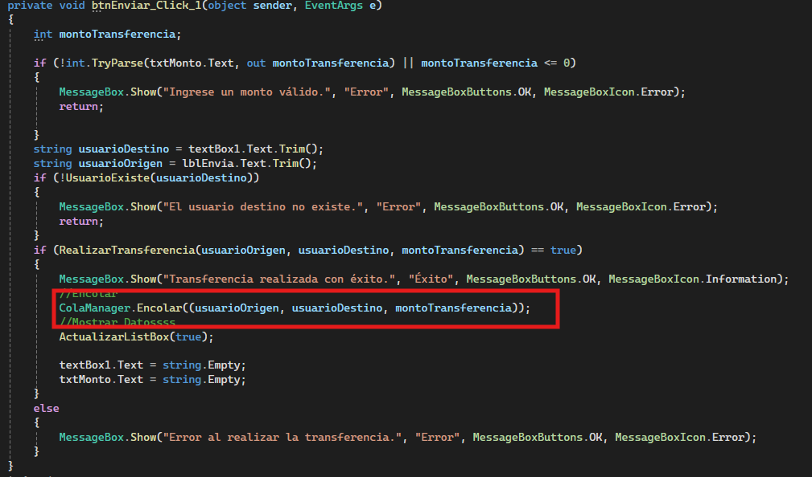
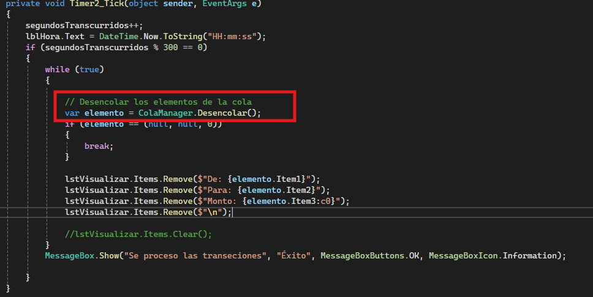
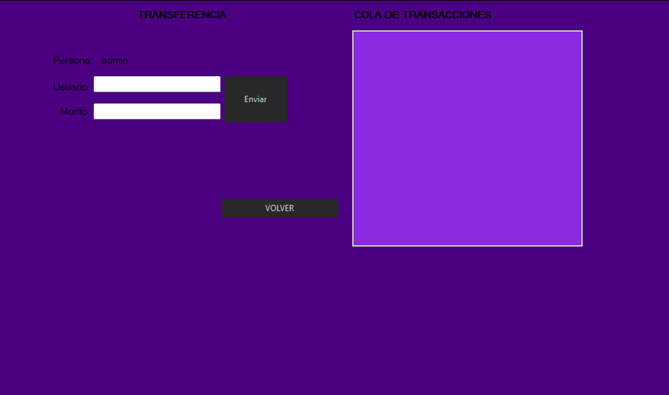
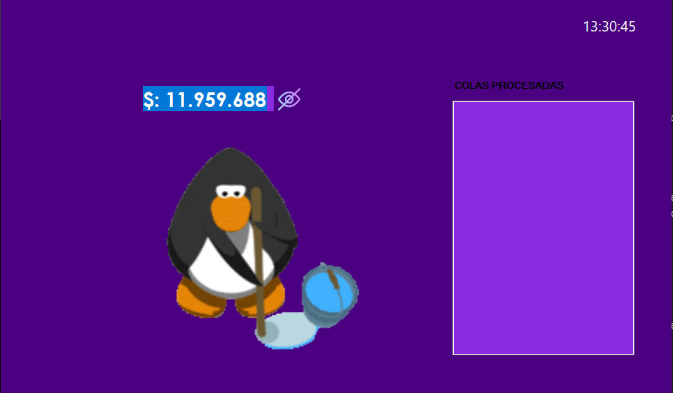

En este proyecto se planea realizar la Implementación de:

* Colas
* Recursión
* Árboles

Se seleccionan estas estructuras en base al tipo de proyecto que se esta realizando y a sus usos, se considera que son los mas adecuados para su implementacion.

El diseño e implementación de las demas estructuras se iran actualizando en los siguientes checkpoint.
En este caso solo se plantea el uso de Colas.

## Uso de Colas
En la primera parte del proyecto se realiza la implementacion de Colas.

### Recurso de Imagen: https://es.wikipedia.org/wiki/Cola_%28informática%29

### Implementación

Dado que el proyecto se enfoca en la simulación de un Banco, lo que se trata de manejar es una cola de transacciones, es decir:

En nuestro código despues de realizar cierta cantidad de Validaciones, se procede a ejecutar el método **Encolar**, lo que hace que las transacciones pasen a una cola de espera y luego de transcurrido un tiempo setteado por un **Timer** proceden a ser desencoladas.

## Visualización

En los formularion del ejecutable se incorpora unos **ListBox** con el único fin de mostrar y/o visualizar el proceso anteriormente descrito.

En este caso el primer screenshot, en el ListBox de la derecha se visualiza las transacciones que son **Encoladas**

En el segundo screenshot se podrá visualizar las transacciones que se han **desencolado** y proceden finalmente a ser ejecutadas.

