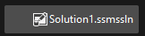
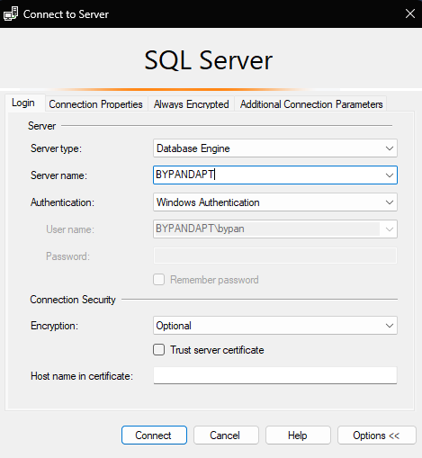
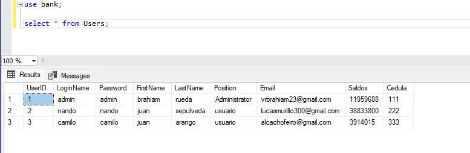
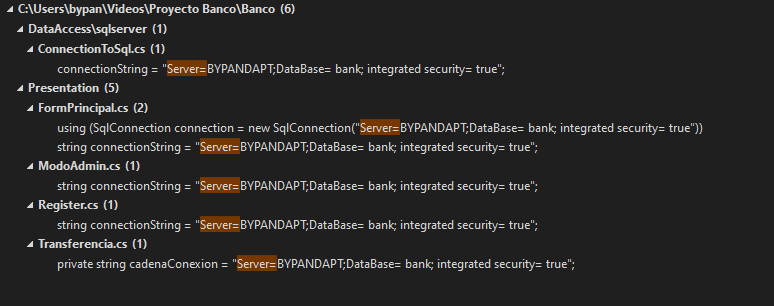

# Proyecto de Aula
## Banco Universitario

### Instrucciones:

En los archivos contenidos en el repositorio se encuentra la base de datos de Ejemplo, necesaria para la ejecución del código.

Por lo tanto es necesario la utilización de Software que pueda abrir e interactuar con archivos de SQL Server.
En nuestro caso se usa: 
* SQL Server Management Studio

!

Una vez se tenga el software a usar solo se debe tener en cuenta el servidor de conexión a usar, el cual se haya configurado posteriormente.

En este caso se usa una Autenticación de Windows, y un server name: BYPANDAPT

Una vez establecida la conexion y accedido a la Base de Datos, mediante este Query como ejemplo se puede ver la tabla de datos que es utilizada.

Luego de haber culminado y satisfactoriamente tener establecida la conexión, se deben seguir otras instrucciones para la ejecución del Código.

Todas las instrucciones: **"Server=DESKTOP-3M54DE5;DataBase= bank; integrated security= true";**
en la instruccion **"Server=DESKTOP-3M54DE5** debe cambiarse **"DESKTOP-3M54DE5"** por tu servidor de conexión, en este caso **"BYPANDAPT"**.

En la imagen se muestra la ruta de los archivos que deben ser editados para el cambio de Base de Datos.

Esto debería ser suficiente para proceder con la ejecución correcta del Código.

